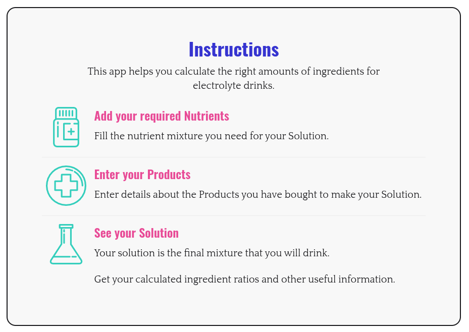

# Electrolyte Solution Calculator
Home made electrolyte solutions can be difficult to get the right ingredients and ratios right... But it doesn't have to be! Electrolyte Solution Calculator (ESC) simplifies this process and determines the exact ratios you require.

Visit the app here:

https://spiratil.github.io/electrolyte-measurements

## Features
 - Solutions are calculated using a linear optimization.
 - Solutions can be calculated to be exact to your nutrient requirements, or calculated to reduce the overall cost, (where possible).
 - Your solutions are stored on your device in local storage as cache and will stay there indefinitely. If you want to remove them, just delete them inside the app.
 - The app has been optimized for both Desktop, Tablet and Mobile.
## Limitations
 - Optimizations may not be able to find a solution with your required nutrients if you do not have enough products or if your products can not be mixed together in a way to meet your required nutrients.
 - Cost optimizations are only possible when there are more than one optimization solution for the ratios of required nutrients and won't be displayed in this case.
## Motivation
This has been a small project built with and for the purpose of learning Svelte.
## Disclaimer
This app is a free tool meant to help plan and organise electrolyte solutions. It might not always be accurate or complete, and it’s up to you to double-check the results before using them. We’re not responsible for any mistakes, problems, or outcomes from using this app. Always talk to a health professional if you’re planning to consume any mixtures or supplements.
## License
The project has been released under Creative Commons. You are free to use, copy and modify this repository as you like.